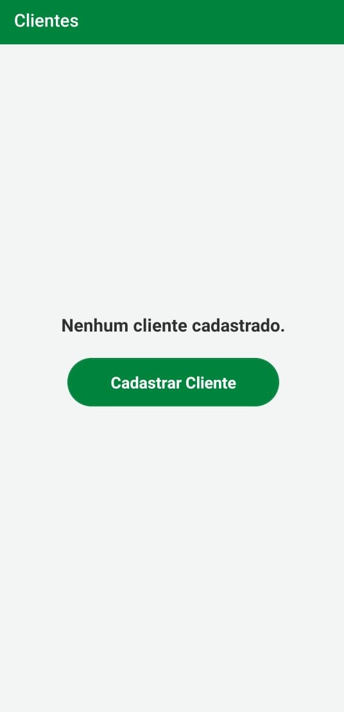

React Native app  Customer Crud - For Android
===

This APP is a simple crud using firebase technologies for data logging and recovery.

## Download
Go to the [APK download android](https://drive.google.com/file/d/1GW5vl0zfTx0l4z0CLxJONhR6vOmxx9q8/view?usp=sharing).
## App preview
<div>




 
<div>
  
## Get started
  
### Clone the repo
```shell
git clone https://github.com/BrittoPaulo/CustomerCrud
```

### Install npm packages

```shell
npm install / yarn install
  
react-native run-android
```

